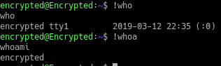

#
LAPORAN SISTEM OPERASI

##
Tugas 5A-Bekerja Dengan Bash Shell

**
Oleh: 
**
Hafidh Sajid Malik

TI-1D-09

###TUGAS PENDAHULUAN :
Jawablah pertanyaan-pertanyaan di bawah ini :
1. Apa yang dimaksud dengan shell dan sebuatkan shell yang ada di system operasi
Linux.
2. Apa yang dimaksud dengan profile pada Bash Shell.
3. Apa yang Anda ketahui mengenai file . bashrc.
4. Apa yang dimaksud dengan history pada Bash Shell. Apa kegunaan perintah
history, sebutkan cara-cara untuk mengetahui history perintah-perintah yang pernah
digunakan oleh user!
5. Cobalah menggunakan editor vi untuk mengetik dan pahami perintah-perintah yang
ada seperti yang terdapat pada dasar teori (untuk dilakukan, tidak perlu dijawab
sebagai tugas pendahuluan). Perintah-perintah yang penting : insert huruf(kalimat),
delete (per huruf, per kata dan per baris), simpan file dan keluar dari editori vi.
Jawab: 
1. Shell adalah Command executive, artinya program yang menunggu intruksi dari pemakai, memeriksa sintak dari instruksi yang diberikan, kemudian mengeksekusi perintah tersebut. Shell ditandai dengan prompt. Untuk pemakai menggunakan prompt $ dan untuk superuser menggunakan prompt #.
Beberapa macam shell:
• /bin/sh : Bourno shell, dirancang oleh Steve Bourne dari AT&T
• /bin/csh : Dikembangkan oleh UNIX Beerkeley yang dikenal dengan C -Shell
• /bin/bash : Kompatibel dengan Bourne Shell dan juga mengadaptasi kemampuan Kom-Shell.
2. Profile pada bash shell merupakan profil untuk setiap pemakai pada home directory.
3. File .bashrc adalah file yang akan dieksekusi untuk perpindahan dari satu shell ke shell yang lain melalui intruksi su
4. History yaitu catatan dari semua intruksi yang sejauh ini telah dilakukan. History memudahkan pemakai untuk mengedit kembali instruksi kompleks dan panjang, terutama bila terjadi kesalahan pada penulisan instruksi maupun parameter
• ^P (Ctrl -P) melihat instruksi
• ^N (Ctrl -N) melihat instruksi berikutnya
• !! eksekusi kembali instruksi sebelumnya
• !! -3 3 instruksi sebelumnya akan diulang
• !!88 ulangi instruksi no 88

###Percobaan 1: Profile
1. File .bash_profile dijalankan pada home direktori pemakai yang login. File
.bash_profile adalah hidden file, sehingga untuk melihatnya gunakan opsi a
pada instruksi ls.
`$ ls –a`
$ more .bash_profile
2. File .bash_logout akan diekseksi sesaat sebelum logout, berfungsi sebagai
house clearing jobs, artinya membersihkan semuanya, misalnya menghapus
temporary file atau job lainnya. Melihat file .bash_logout dengan instruksi
`$ cat .bash_logout`

###Percobaan 2: Menggunakan Feature History Bash
1. Bash shell menyimpan ”history” perintah yang digunakan sebelumnya. Anda
dapat mengaksis history dalam beberapa cara. Cara paling mudah adalah
menggunakan Panah Atas. Maka perintah sebelumnya akan ditampilkan.

2. Berikutnya, berikan Bash shell beberapa perintah untuk diingat. Masukkan
perintah berikut dan tekan Enter pada setiap baris.
`$ cd`
`$ ls –l /etc`
`$ ls –l`
`$ whoami`
`$ who``

3. Untuk memeriksa apakah perintah ini ditambahkan pada history, dapat
menggunakan perintah history untuk melihat semua perintah yang pernah
dimasukkan.
`$ history`

4. Anda dapat memilih perintah sebelumnya dengan menggunakan Panah Atas ,
tetapi hal ini tidak efisien untuk perintah yang semakin bertambah banyak.
Cara yang mudah menggunkaan nomor pada perintah history atau
mencarinya.
 Untuk memilih dan mengeksekusi perintah dengan nomor,
masukkan kunci ! diikuti nomor perintah.
`$ !<Nomor Perintah>`  Contoh : !780

5. Anda dapat mencari perintah dengan menyertakan perintah yang diinginkan.
Misalnya !?etc?! akan menjalankan perintah ls –l /etc yang sebelumnya
digunakan.
`$ !?etc?`

6. Kemudian gunakan perintah history, maka akan terlihat perintah ls –l
/etc yang kedua dan bukan !?etc?
`$ history`

7. Apabila string tidka ditemukan pada perintha history maka akan terdapat
pesan error.
`$ !?wombat99?`

8. Jika diketikkan !who maka yang dijalankan adalah perintah who . Tetapi bila
Anda ketikkan !whoa maka yang dijalankan adalah perintah whoami .
`$ !who`
`$ !whoa`

9. Anda bisa menggantikant string pada perintah history, terutama pada perintah
yang panjang. Misalnya ketik cat /bin/bash | strings | grep shell | less dan
tekan Enter . Maka akan menampilkan semua string pada file /bin/bash
yang berisi kata ”shell”. Untuk keluar tekan q. Jika ingin menampilkan kata
”alias”, maka Anda tidak perlu mengetik perintah yang panjang lagi, tetapi
cukup ketik ^shell^alias^ dan tekan Enter maka akan menggantikan kata
”shell” dengan ”alias”.
`$ cat /bin/bash | strings | grep shell | less`

`$ ^shell^alias^`

###Percobaan 3 Mengubah Feature History Bash
1.Bash shell akan menyimpan perintah history meskipun telah log out dan log
in kembali. File .bash_history menyimpan file history yang terdapat
pada home directory.
`$ cd`

2.Lihat beberapa baris pada file .bash_history dengan ketik tail .bash_history
dan tekan Enter. File ini bukan file yang up to date.
`$ tail .bash_history`

3.Ketik history dan tekan Enter . Maka akan terlihat baris terakhir adalah
perintah history dan baris sebelumnya adalah tail .bash_history .
Perintah history bersifat up to date, karena disimpan pada memory sistem.
`$ history`

4.Ketik perintah berikut
`$ echo ‘Ini perintah saya’`

5.Log out dan log in kembali sebagai user yang sama. Ketik history dan tekan
Enter . Maka perintah echo ’Ini perintah saya’ akan berada pada
baris terakhir. Lihat file .bash_history , maka perintah tsb akan terdapat
pada file .bash_history .
`$ history`

`$ tail .bash_history`

6.Ketik history|less untuk melihat perintah history terakhir pada screen. Tekan
spacebar untuk melihat file lebih banyak. Untuk keluar tekan q
`$ history|less`

7.Untuk melihat berapa banyak perintah history yang ada pada file ketik berikut
dan output yang keluar serupa di bawah ini
`$ wc –l .bash_history`
`1000 .bash_history`

8. Output menunjukkan bahwa 1000 perintah history disimpan pada file history.
Untuk melihat jangkauan (limit) perintah history digunakan variabel
HISTSIZE. Untuk melihat jangkauan history ketik sebagai berikut
`$ set|grep HISTSIZE`

9. Bila ingin memperbesar jangkauan file history, maka ubahlah variabel
HISTSIZE pada skrip startup yang disebut .bashrc pada home directory.
`$ echo ‘HISTSIZE=5000’ >> .bashrc`

10. Log out dan log in kembali sebagai user yang sama.
 Lihat perubahan
variabel HISTSIZE.
`$ set|grep HISTSIZE`

11. Ketikkan perintah history beberapa kali, maka perintah ini akan disimpan
pada BASH history meskipun yang diketikkan perintahnya sama.

12. Anda dapat melakukan konfigurasi BASH agar tidak menambah perintah ke
history jika perintah yang diketikkan sama dengan sebelumnya. Hal ini
dilakukan dengan menambahkan variabel HISTCONTROL dan diberikan
nilai ignoredups pada file .bashrc
`$ echo ‘HISTCONTROL=ignoredups’ >> .bashrc`

13. Log out dan log in kembali sebagai user yang sama . Ketikkan history
beberapa kali dan perhatikan berapa kali history muncul.

###Percobaan 4: Mengubah Prompt Shell
1. Prompt Bash shell dikonfigurasi dengan men-setting nilai variabel PS1.
Selain menampilkan string statik sebagai prompt, Anda dapat menampilkan
menjadi dinamis. Contohnya, apabila ingin menunjukkan current directory
atau current time.
 Ketik PS1=’\t:’ dan tekan Enter untuk menampilkan
waktu sistem da lam format 24 jam sebagai prompt Bash.
 Format dalam
HH:MM:SS
`$ PS1=’\t:’`

Analisa: Perintah di atas digunakan untuk menampilkan waktu system dalam format 24 jam, dalam contoh diatas waktu yang ditampilkan adalah jam 12 menit 36 dan detik 17
3. Untuk menampilkan format 12 jam dengan indikator am dan pm ketik
sebagai berikut :
`$ PS1=’\t:’`

4. Kebanyakan orang menginginkan prompt Bash menampilkan current
working directory. Direktory dapat ditampilkan dalam bentuk keseluruhan
path atau hanya nama direktory.
 Karakter \w menampilkan hanya nama
direktory. Jika current directory adalah home directory, maka tampil prompt
`~:`
`$ PS1=’\w:’`

Analisa: Perintah di atas digunakan untuk melihat prompt sbin dimana user sedang aktfi sebagai ~
5. Ketik cd /usr/sbin untuk melihat prompt /usr/sbin:
`$ cd /usr/sbin`

5. Ketik PS1=’\W:’ untuk melihat prompt sbin:
`$ PS1=’\W:’`

6. Ada beberapa prompt BASH lain yang dapat diubah, yaitu PS2, PS3 dan PS4.
Prompt PS2 digunakan sebagai prompt sekunder. Untuk melihat bagaimana
penggunaannya, ketik echo ’Hello (tanpa diakhiri penutup quote) dan tekan
Enter . Simbol lebih besar dari (>) akan muncul. Hal ini memberitahukan
bahwa BASH menunggu Anda menyelesaikan perintah. Ketik penutup quote
(‘) dan tekan Enter. Perintah ini akan menyelesaikan prompt PS2, kata
”Hello, ” muncul diikuti dengan prompt PS1 pada baris baru.
`$ echo ’Hello`
`>’`

7. Anda dapat mengubah prompt PS2 seperti mengubah prompt PS1. Ketik
perintah berikut :
`$ PS2=’Selesai memasukkan perintah Anda:’`

8.Kemudian ketik echo ’Hello (tanpa diakhiri penutup quote) dan tekan Enter.
Pada baris berikutnya akan muncul Selesai memasukkan perintah Anda:.
Kemudian ketikkan penutup quote (’) dan tekan Enter . Jika perintah selesai,
maka kata Hello akan muncul diikuti prompt PS1 pada baris baru.
`$ echo ’Hello`
`Selesai memasukkan perintah Anda:’`

9. Prompt BASH dapat ditampilkan berwar na dengan melakukan setting color-
setting string . Sebagai contoh, prompt BASH di-set dengan \w\$, akan
menampilkan current working directory yang diikuti $ (atau # jika anda
login sebagai root). Untuk setting warna menjadi biru ketikkan berikut :
`$ PS1=’\033[0;34m\w\$ \033[0;37m’`

10. Untuk mendapatkan prompt warna merah ketikkan berikut :
`$ PS1=’\033[0;31m\w\$ \033[0;37m’`

30=hitam, 31=merah, 32=hijau, 34=biru, 35=ungu, 36=cyan, 37=putih.

11. Bila menginginkan beberapa warna, ketikkan perintah berikut :
`$ PS1=’\033[0;31m\w\033[0;32m\$ \033[0;37m’`

12. Anda bisa menampilkan atribut visual seperti lebih terang, berkedip dan
warna kebalikannya. Untuk menampilkan prompt yang lebih terang, atribut
control diganti 1, seperti perintah berikut :
`$ PS1=’\033[1;34m\w\033[1;32m\$ \033[0;37m’`

13. Untuk menampilkan prompt dengan warna berkebalikan, atribut control
diganti 7, seperti perintah berikut :
`$ PS1=’\033[7;34m\w\033[7;32m\$ \033[0;37m’`

14. Untuk menampilkan prompt berkedip, atribut control diganti 5, seperti
perintah berikut :
`$ PS1=’\033[5;34m\w\033[5;32m\$ \033[0;37m’`

Percobaan 5: Menambahkan otomatisasi ke Prompt Shell
1. Pastikan Anda berada di home directory
`$ cd ~`

2. Buatlah skrip sederhana untuk mengurut daftar file.
 Anda dapat
menggunakan teks editor, tetapi karena hanya satu baris, gunakan perintah
echo untuk membuat file.
`$ echo ’sort ~/list > ~/r13; mv ~/r13 ~/list’ > ~/sorter`

3. Buatlah file skrip diatas menjadi file executable
`$ chmod +x sorter`

4. Jalankan program sorter diatas setiap shell Bash menampilkan prompt PS1.
Untuk melakukannya, buatlah variable PROMPT_COMMAND dimana
nilainya adalah nama dari program sorter.
`$ PROMPT_COMMAND=~/sorter`

5. Ketikkan echo ’John Smith:13001’>>list dan tekan Enter . Jika file list
tidak ada, akan dibuat secara otomatis, tetapi jika sudah ada, string ’John
Smith:13001’ aka h ditambahkan.
`$ echo ’John Smith:13001’>>list`

6. Ketik cat list dan tekan Enter. Maka Anda akan melihat isi file list . Pada
saat ini, file mungkin mempunyai hanya satu baris sehingga tidak dapat
dilihat apakah file sudah terurut.
`$ cat list`

7. Masukkan bebe rapa perintah serupa dengan point 5 tetapi dengan nama dan
nomor yang berbeda. Kemudian ketik cat list dan tekan Enter.
`$ echo ’Anita:13002’>>list`
`$ echo ’Samantha:13003’>>list`
`$ echo ’Patrik:13004’>>list`
`$ echo ’Sponse Bob:13005’>>list`
`$ echo ’Lisa:13006’>>list`
`$ echo ’Squid:13007’>>list`

8. Apabila Anda tidak menginginkan Shell Bash menampilkan file terurut sepanjang waktu, Anda tidak perlu menambahkan variable PROMPT_COMMAND=~/sorter pada file konfigurasi seperti .bashrc. Bila
Anda ingin BASH berhenti menjalankan program sorter, maka ketikkan
variable PROMPT_COMMAND= dan tekan Enter atau log out dan login
kembali.
`$ PROMPT_COMMAND=`
