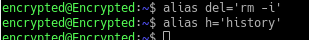

#
LAPORAN SISTEM OPERASI

##
Tugas 5B-Bekerja Dengan Bash Shell

**
Oleh: 
**
Hafidh Sajid Malik

TI-1D-09

###Percobaan 6: Membuat Bash-script dan menjalankannya
1. Membuat file p1.sh
`$ vi p1.sh`

`echo “Program bash Script”`

2. Mengubah program menjadi executable
`$ ls –l p1.sh`

`$ chmod +x p1.sh`
`$ ls –l p1.sh`

3. Menjalankan script
`$ bash p1.sh`
`$ sh p1.sh`
`$ . p1.sh`
`$ ./p1.sh`

4. Konvensi dalam pembuatan script shell dinyatakan sebagai #!/bin/bash.
Tambahkan pada file p1.sh konvensi tersebut
`$ vi p1.sh`
`#!/bin/bash`
`echo “Program bash script”`

5. Buatlah file p2.sh
`$ vi p2.sh`
`#!/bin/bash`
`echo “Program 2 bash script”`

6. Menjalankan beberapa program shell dalam satu baris instruksi yang
dipisahkan dengan tanda ;
`$ cat p1.sh ; cat p2.sh`
`$ ./p1.sh ; ./p2.sh`

###Percobaan 7: Job Control
1. Proses foreground
`$ ps x`

2. Proses background
`$ ps x > hasil &`

3. Setiap job mempunyai PID yang tunggal (unique). Untuk melihat jobs yang
aktif
`$ jobs`

4. Buatlah file ploop.sh. File ini tidak akan pernah berhenti kecuali ditekan
`Ctrl-C`
`$ vi ploop.sh`
`#!/bin/bash`
`while [ true ]`
`do`
`sleep 10`
`echo “Hallo”`
`done`

5. Buatlah file ploop.sh menjadi executable.
 Jalankan program, akan
ditampilkan kata Hallo setiap 10 detik. Untuk keluar program, tekan Ctrl-C
(^C)
`$ chmod +x ploop.sh`
`$ ./ploop.sh`

Percobaan 8: Manipulasi stack untuk Direktori
1. Instruksi dirs
 digunakan untuk melihat stack direktori, pada output hanya
ditampilkan direktori home ~
`$ dirs`

2. Membuat 3 buah direktori
`$ mkdir marketing sales support`

Percobaan 9: Alias
1.Alias adalah mekanisme untuk memberi nama alias pada satu atau sekelompok
instruksi. Untuk melihat alias yang sudah terdaftar pada system :
`$ alias`

2.Membuat beberapa alias
`$ alias del=’rm –i’`
`$ alias h=’history’`

3.Gunakan instruksi hasil alias
`$ ls`
`$ del hasil`
`$ h | more`

4.Untuk menghapus alias gunakan instruksi unalias
`$ unalias del`
`$ del files (Terdapat Pesan Kesalahan, mengapa ?)`

Analisa: Perintah di atas digunakan untuk menghapus alias yang sudah kita buat sebelumnya yaitu alias del (untuk menghapus file) sehingga nantinya perintah ini sudah bukan lagi alias untuk menghapus file. Pada saat kita kembali mencoba menghapus file menggunakan alias del files hal ini akan menimbulkan error command not found karena sebelumnya kita sudah menghapus kata del dari daftar alias
###Latihan:
1. Eksekusi seluruh profile yang ada :
a. Edit file profile /etc/profile dan tampilkan pesan seba gai berikut :
`echo ’Profile dari /etc/profile’`

b. Asumsi nama anda student , maka edit semua profile yang ada yaitu :
`/home/student /.bash_profile`
`/home/. student/.bash_login`
`/home/student /.profile`
`/home/student /.bashrc`

c. Ganti nama /home/student dengan nama anda sendiri. Pada setiap file tersebut, cantumkan instruksi echo, misalnya pada /home/student/.bash_profile:
`echo “Profile dari .bash_profile”`

d. Lakukan hal yang sama untuk file lainnya, sesuaikan tampilan dengan nama
file yang bersangkutan.

2. Jalankan instruksi subtitute user, kemudian keluar dengan perintah exit sebagai
berikut :
`$ su student`
`$ exit`
kemudian gunakan opsi – sebagai berikut :
`$ su – student`
`$ exit`
Jelaskan perbedaan kedua utilitas tersebut.

Analisa: su merupakan perintah yang berfungsi untuk memasukkan perintah dalam user. Perbedaan nya hanyalah terletak pada bagian proses keluar. Jika user memasukan perintah “su username. Maka user akan diminta untuk mealakukan login, dan ketika perintah exit dimasukan, user akan langsung dikeluarkan tanpa proses logout. Artinya ketika keluar, program masih berjalan. Untuk perintah yang kedua, su – username. Ketika dilakukan exit, sistem akan melakukan logout terlebih dahulu, dalam artikata lain semua program yang berjalan akan di hentikan.
3.Logout
a. Edit file .bash_logout , tampilkan pesan dan tahan selama 5 detik, sebelum
eksekusi logout
Echo “Terima kasih atas sesi yang diberikan”
Sleep 5
Clear

Analisa: Perintah di atas digunakan untuk membuka file .bash_logout yang terdapat pada user prince46 menggunakan perintah nano dan memasukkan pesan teks “Terima kasih atas sesi yang diberikan” di dalamnya dan menahan pesan tersebut selama 5 detik sebelum eksekusi logout
b. Edit file .bash_logout , tampilkan pesan dan tahan selama 4 detik, sebelum
eksekusi logout

Analisa: Perintah-perintah tersebut merupakan perintah yang berfungsi untuk melakukan edit pada file bash_logut, digunakan perintah “nano”. Setelah itu maka akan muncul tampilan shell yang digunakan untuk mengedit file tersebut. User hanya memasukan string yang ber tuliskan. ”Terima kasih atas sesi yang telah diberikan”. Setelah itu dilakukan edit pada bagian metode penampilan script tersebut setelah user melakukan logout. Sesi pertama adalah dilakukan sleep 5 detik, sesi kedua dilakukan sleep 4 detik kemudian clear. Hasil akhir ketika user memasukan perintah exit, progam akan menampilkan string yang telah dipasangkan tadi.
4. History
a. Ganti nilai HISTSIZE dari 1000 menjadi 20
`$ HISTSIZE=20`
`$ h`

Analisa: Perintah-perintah tersebut digunakan untuk mengganti nilai HISTSIZE dari 1000 menjadi 20 dan melakukan pembelokkan ganda nilai HISTSIZE 20 ke file bernama .bashrc
b. Gunakan fasilitas history dengan mengedit instruksi baris ke 5 dari instruksi
yang terakhir dilakukan.
`$ !-5`

c. Ulangi instruksi yang terakhir. Gunakan juga ^P dan ^N untuk bernavigasi
pada history buffer
`$ !!`

d. Ulaingi instruksi pada history buffer nomor tertentu, misalnya nomor 150
`$ !150`

e. Ulangi instruksi dengan prefix “ls”
`$ !ls`
`$ !?ls?`

Jelaskan perbedaan instruksi diatas
Jelaskan perbedaan instruksi di atas
Analisa: Perbedaan instruksi di atas terdapat pada keyword yang diinputkan dan maksud dari keyword yang diinputkan. Jika mengetikkan !ls (keyword akan mencari kata pada daftar history yang berhubungan dengan kata ls termasuk daftar direktori dari user), jika mengetikkan !?ls? (keyword akan mencari kata pada daftar history dan .bash_history yang berhubungan dengan kata yang mengandung ls di dalamnya mulai dari direktori yang ada pada user hingga daftar history system yang pernah diakses user)

5.Prompt String (PS)
a. Edit file .bash_profile , ganti prompt PS1 dengan ‘>’. Instruksi export
diperlukan dengan parameter nama variab le tersebut, agar perubahan variable
PS1 dikenal oleh semua shell
`PS1=’> ‘`
`export PS1`

Eksperimen hasil PS1 :
`$ PS1=“\! > “`
`69 > PS1=”\d > “`
`Mon Sep 23 > PS1=”\t > “`
`10:10:20 > PS1=”Saya=\u > “`
`Saya=stD02001 > PS1=”\w >”`
`~ > PS1=\h >”`

b. Ubahlah warna shell prompt dengan warna biru dan berkedip.

6. Bash script
a. Buat 3 buah script p1.sh, p2.sh, p3.sh dengan isi masing-masing :
`p1.sh`
`#! /bin/bash`
`echo “Program p1”`
`ls –l`

`p2.sh`
`#! /bin/bash`
`echo “Program p2”`
`Who`

`p3.sh`
`#! /bin/bash`
`echo “Program p3”`
`ps x`

b. Jalankan script tersebut sebagai berikut dan perhatikan hasilnya :
`$ ./p1.sh ; ./p3.sh ; ./p2.sh`

`$ ./p1.sh &`

`$ ./p1.sh $ ./p2.sh & ./p3.sh &`

`$ ( ./p1.sh ; ./p3.sh ) &`

7. Jobs
a. Buat shell- script yang melakukan loop dengan nama pwaktu.sh , setiap 10
detik, kemudian menyimpan tanggal dan jam pada file hasil.
`#!/bin/bash`
`while [ true ]`
`do`
`date >> hasil`
`sleep 10`
`Done`

b. Jalankan sebagai background; kemudian jalankan satu program (utilitas find)
di background sebagai berikut :
`$ jobs`
`$ find / -print > files 2>/dev/null &`
`$ jobs`

c. Jadikan program ke 1 sebagai foreground, tekan ^Z dan kembalikan program
tersebut ke background
`$ fg %1`
`$ bg`
d. Stop program background dengan utilitas kill
`$ ps x`
`$ kill [Nomor PID]`

Analisa: Perintah di atas digunakan untuk melihat daftar proses yang berjalan di latar depan dan dilanjutkan dengan perintah kill untuk mematikan proses yang sedang berjalan dimana pada contoh di atas kita memilih mematikan proses yang memiliki nomor PID 2438 dengan mengetikkan keyword kill 2438

##Laporan Resmi:
1. Analisa hasil percobaan yang Anda lakukan.
2. Kerjakan latihan diatas dan analisa hasil tampilannya.
3. Berikan kesimpulan dari praktikum ini.
Kesimpulan:
• Shell adalah Command executive, artinya program yang menunggu intruksi dari pemakai, memeriksa sintak dari instruksi yang diberikan, kemudian mengeksekusi perintah tersebut. Shell ditandai dengan prompt. Untuk pemakai menggunakan prompt $ dan untuk superuser menggunakan prompt #
• Profile pada bash shell merupakan profil untuk setiap pemakai pada home directory
• File .bashrc adalah file yang akan dieksekusi untuk perpindahan dari satu shell ke shell yang lain melalui intruksi su
• History yaitu catatan dari semua intruksi yang sejauh ini telah dilakukan. History memudahkan pemakai untuk mengedit kembali instruksi kompleks dan panjang, terutama bila terjadi kesalahan pada penulisan instruksi maupun parameter
• Perintah shell dapat dieksekusi asalkan dirubah terlebih dahulu menjadi file executable
• Cara eksekusi file shell yaitu bash, sh, ., dan ./
• Syntax di linux dapat dibuat alias command
• Masa berlaku background proses sampai komputer restart atau shutdown
• Apabila komputer hanya di logout maka background proses masih tetap berjalan